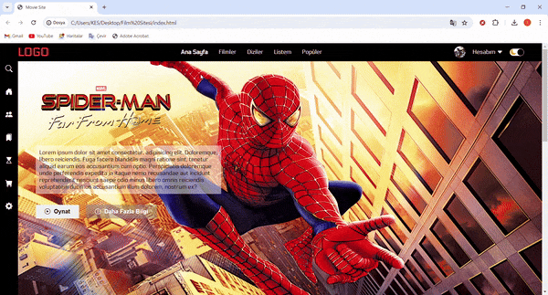

# Movie Site

- This movie website I designed attracts attention with its color transitions and hover feature. 
- It allows switching between movies with the Slider feature I provided using JavaScript.
- The color of the site can be updated by clicking the icon in the profile section.
- Semantic Element: This codes are provided easy for the browser and developer to understand.
- Color Transitions: Color transitions are provided by using CSS and transition properties. These transitions add a modern and fluid atmosphere to the site.
- Font Family: By using the Google Font feature, the fonts have a pleasant appearance.
- Responsive Layout: A responsive structure was established using Flexbox ve Media Tags techniques. In this way, a compatible appearance is provided even on different screen sizes.

# The following technologies were used in the frontend development phase of my site:

- HTML5
- CSS3
- JavaScript

# Preview

